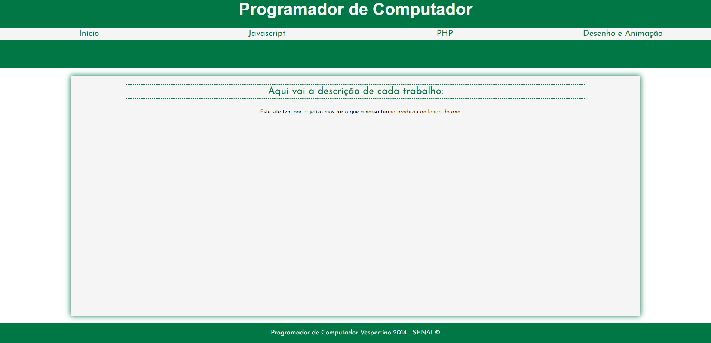

# Mundo Senai Portal

> Projeto realizado para o evento Mundo Senai, pela turma de Aprendizagem Industrial de Programador de Computador no SENAI/SC Brusque de 2014 na qual eu participei.
## 📫 Acesse o portal:

https://thalesms2-mundo-senai.herokuapp.com/

## 💻 Pré-requisitos

Antes de começar, verifique se você atendeu aos seguintes requisitos:
* Você instalou a versão mais recente do Apache e PHP.
* Você tem uma máquina Windows / Linux / Mac.

## 🚀 Instalando Mundo Senai Portal

Para instalar o Mundo Senai Portal, siga estas etapas:

Clone o repositório;
Copie os arquivos para o servidor apache de sua preferencia;

## 🤝 Colaboradores

Agradecemos às seguintes pessoas que contribuíram para este projeto:
<ul>
  <li>Professor Lucas</li>
  <li>Professor Tarcisio</li>
  <li>Ana Paula</li>
  <li>Andreas</li>
  <li>Arthur</li>
  <li>Emerson</li>
  <li>Felipe Locatelli</li>
  <li>Heber</li>
  <li>Henrico</li>
  <li>Ianael</li>
  <li>Jean</li>
  <li>João Felipe</li>
  <li>João Rosário</li>
  <li>Junior</li>
  <li>Lais</li>
  <li>Leonardo Heckert</li>
  <li>Lissandra</li>
  <li>Lucas Ferrari</li>
  <li>Lucas Pereira</li>
  <li>Maria</li>
  <li>Marley</li>
  <li>Matheus Frutuoso</li>
  <li>Mateus Jorge</li>
  <li>Nathan</li>
  <li>Patricia</li>
  <li>Rebecca</li>
  <li>Romulo</li>
  <li>Ronaldo</li>
  <li>Thales</li>
  <li>Willian</li>
</ul>
